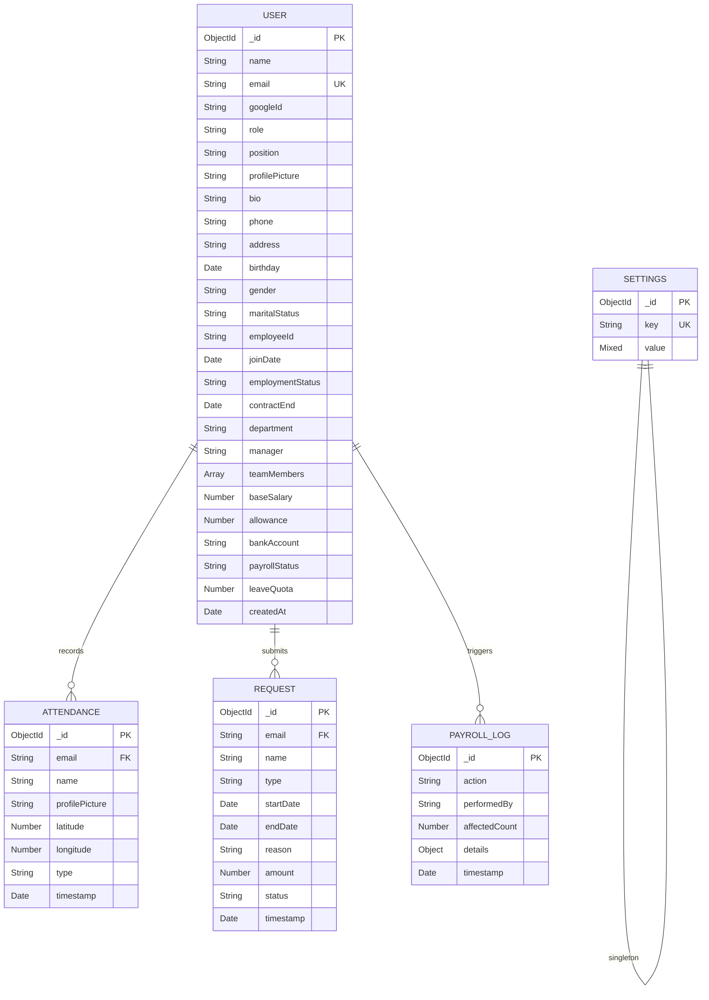

# Database Schema
## EMS — Employee Management System
**Database:** MongoDB (NoSQL Document Store)
**ODM:** Mongoose v8+
**Last Updated:** 17 April 2026

---

## Entity Relationship Diagram

---

## Collection 1: `users`

Model file: [User.js](file:///c:/Users/Zidhan/OneDrive/Documents/hris-project/server/models/User.js)

| Field | Type | Required | Default | Constraint | Description |
|-------|------|----------|---------|------------|-------------|
| `_id` | ObjectId | Auto | — | PK | MongoDB auto-generated |
| `name` | String | ✅ | — | — | Nama lengkap dari Google |
| `email` | String | ✅ | — | **Unique** | Email Google (login identifier) |
| `googleId` | String | — | — | — | Google sub ID |
| `role` | String | — | `employee` | Enum: `employee`, `hrd`, `manager`, `admin` | Level akses |
| `position` | String | — | `Staff` | — | Jabatan profesional |
| `profilePicture` | String | — | — | — | URL foto profil Google |
| `bio` | String | — | `-` | maxlength: 250 | Deskripsi singkat |
| `phone` | String | — | `-` | — | Nomor telepon |
| `address` | String | — | `-` | — | Alamat tinggal |
| `birthday` | Date | — | `null` | — | Tanggal lahir |
| `gender` | String | — | `-` | Enum: `Male`, `Female`, `Other`, `-` | Jenis kelamin |
| `maritalStatus` | String | — | `-` | — | Status pernikahan |
| `employeeId` | String | — | `EMS-000` | — | ID karyawan (format: EMS-XXX) |
| `joinDate` | Date | — | `Date.now` | — | Tanggal bergabung |
| `employmentStatus` | String | — | `Probation` | — | Status kerja |
| `contractEnd` | Date | — | `null` | — | Akhir kontrak (auto 3 bulan untuk Probation) |
| `department` | String | — | `General` | — | Departemen |
| `manager` | String | — | `HR Manager` | — | Nama atasan |
| `teamMembers` | Array[Object] | — | `[]` | — | Daftar anggota tim `{ name, position, email }` |
| `baseSalary` | Number | — | `5000000` | — | Gaji pokok (IDR) |
| `allowance` | Number | — | `0` | — | Tunjangan (IDR) |
| `bankAccount` | String | — | `-` | — | Nomor rekening bank |
| `payrollStatus` | String | — | `Unpaid` | Enum: `Unpaid`, `Paid` | Status pembayaran bulan ini |
| `leaveQuota` | Number | — | `0` | — | Sisa jatah cuti tahunan |
| `createdAt` | Date | — | `Date.now` | — | Timestamp pembuatan akun |

---

## Collection 2: `attendances`

Defined inline in [index.js](file:///c:/Users/Zidhan/OneDrive/Documents/hris-project/server/index.js) (line 88-96)

| Field | Type | Required | Default | Constraint | Description |
|-------|------|----------|---------|------------|-------------|
| `_id` | ObjectId | Auto | — | PK | MongoDB auto-generated |
| `email` | String | — | — | — | Email karyawan (FK ke Users) |
| `name` | String | — | — | — | Nama saat absensi |
| `profilePicture` | String | — | — | — | URL foto profil |
| `latitude` | Number | — | — | — | Koordinat GPS latitude |
| `longitude` | Number | — | — | — | Koordinat GPS longitude |
| `type` | String | — | `clock_in` | Enum: `clock_in`, `clock_out` | Tipe absensi |
| `timestamp` | Date | — | `Date.now` | — | Waktu pencatatan |

---

## Collection 3: `requests`

Model file: [Request.js](file:///c:/Users/Zidhan/OneDrive/Documents/hris-project/server/models/Request.js)

| Field | Type | Required | Default | Constraint | Description |
|-------|------|----------|---------|------------|-------------|
| `_id` | ObjectId | Auto | — | PK | MongoDB auto-generated |
| `email` | String | ✅ | — | — | Email pemohon |
| `name` | String | ✅ | — | — | Nama pemohon |
| `type` | String | ✅ | — | Enum: `Leave`, `Permit`, `Sick`, `Overtime`, `Reimbursement`, `Timesheet`, `Expense`, `Other` | Tipe permohonan |
| `startDate` | Date | — | — | — | Tanggal mulai |
| `endDate` | Date | — | — | — | Tanggal selesai |
| `reason` | String | ✅ | — | — | Alasan / deskripsi |
| `amount` | Number | — | — | — | Jumlah (untuk Reimbursement/Expense) |
| `status` | String | — | `Pending` | Enum: `Pending`, `Approved`, `Rejected`, `Returned` | Status persetujuan |
| `timestamp` | Date | — | `Date.now` | — | Waktu pengajuan |

---

## Collection 4: `settings`

Defined inline in [index.js](file:///c:/Users/Zidhan/OneDrive/Documents/hris-project/server/index.js) (line 98-101)

| Field | Type | Required | Default | Constraint | Description |
|-------|------|----------|---------|------------|-------------|
| `_id` | ObjectId | Auto | — | PK | MongoDB auto-generated |
| `key` | String | ✅ | — | **Unique** | Identifier setting |
| `value` | Mixed | — | — | — | Nilai setting (flexible type) |

### Known Settings Keys

| Key | Value Type | Example Value | Description |
|-----|-----------|---------------|-------------|
| `office_location` | Object | `{ name, lat, lng, radius }` | Lokasi & radius kantor |
| `work_days` | Array[String] | `["Monday", ..., "Friday"]` | Hari kerja aktif |

---

## Collection 5: `payrolllogs`

Model file: [PayrollLog.js](file:///c:/Users/Zidhan/OneDrive/Documents/hris-project/server/models/PayrollLog.js)

| Field | Type | Required | Default | Description |
|-------|------|----------|---------|-------------|
| `_id` | ObjectId | Auto | — | PK |
| `action` | String | ✅ | — | Enum: `FINALIZE_ALL`, `MARK_PAID_ALL`, `SEND_EMAILS` |
| `performedBy` | String | ✅ | — | Email admin yang melakukan aksi |
| `affectedCount` | Number | ✅ | — | Jumlah data yang terpengaruh |
| `details` | Object | — | `{}` | Informasi tambahan (misal: periode, filter) |
| `timestamp` | Date | — | `Date.now` | Waktu log dibuat |

---

## Indexes

| Collection | Field | Type | Purpose |
|------------|-------|------|---------|
| `users` | `email` | Unique | Login lookup, prevent duplicates |
| `settings` | `key` | Unique | Fast setting retrieval |
| `attendances` | `timestamp` | Default | Time-range queries |
| `payrolllogs` | `timestamp` | Default | Audit trail sorting |
