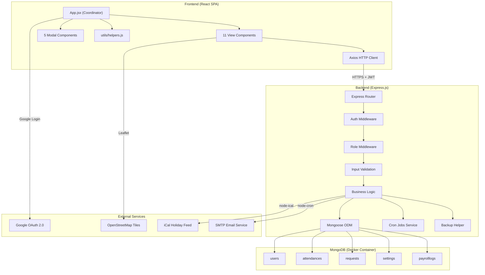
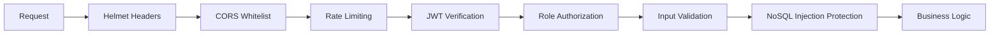
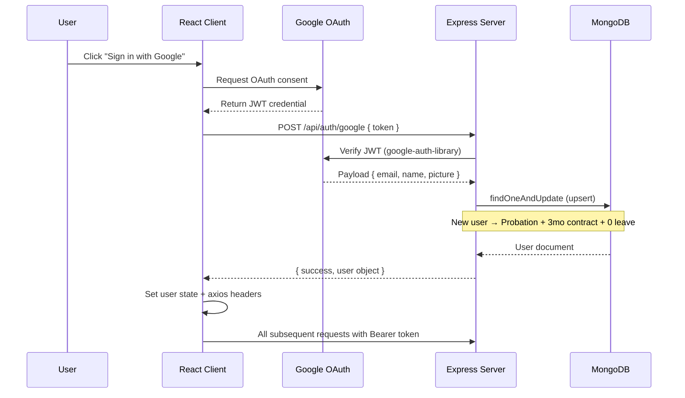
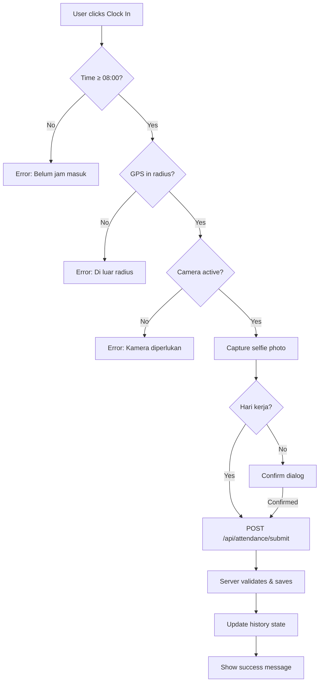

# Technical Specification Document (TSD)
## EMS — Employee Management System
**Version:** 2.0 (Post-Refactoring)
**Last Updated:** 17 April 2026

---

## 1. System Architecture

---

## 2. API Endpoints

### 2.1 Authentication

| Method | Endpoint | Auth | Role | Description |
|--------|----------|------|------|-------------|
| POST | `/api/auth/google` | ❌ | All | Login/Register via Google OAuth JWT |

### 2.2 User Profile

| Method | Endpoint | Auth | Role | Description |
|--------|----------|------|------|-------------|
| PUT | `/api/users/profile` | ✅ | Self | Update profil pribadi |

### 2.3 Attendance

| Method | Endpoint | Auth | Role | Description |
|--------|----------|------|------|-------------|
| POST | `/api/attendance/submit` | ✅ | All | Clock In / Clock Out |
| GET | `/api/attendance/history` | ✅ | All | Riwayat absensi (by email, month, year) |
| GET | `/api/attendance/summary/today` | ✅ | All | Statistik hari ini (total, present, late) |
| GET | `/api/attendance/summary/monthly` | ✅ | Admin/Manager/HRD | Laporan bulanan semua karyawan |

### 2.4 Employees

| Method | Endpoint | Auth | Role | Description |
|--------|----------|------|------|-------------|
| GET | `/api/employees` | ✅ | All* | Daftar karyawan (filtered by role) |
| PUT | `/api/employees/:id` | ✅ | Admin/Manager/HRD | Update data karyawan |
| DELETE | `/api/employees/:id` | ✅ | Admin | Hapus karyawan |
| PUT | `/api/employees/:id/payroll` | ✅ | Admin/HRD | Update payroll karyawan |
| PUT | `/api/payroll/finalize-all` | ✅ | Admin/HRD | Finalisasi gaji seluruh karyawan |
| PUT | `/api/payroll/mark-all-paid` | ✅ | Admin/HRD | Tandai semua gaji sudah dibayar |
| GET | `/api/payroll/logs` | ✅ | Admin/HRD | Lihat audit log aktifitas payroll |

> *Employee role mendapat field terbatas (tanpa salary, kontrak sensitif)

### 2.5 Requests (Leave, Permit, etc.)

| Method | Endpoint | Auth | Role | Description |
|--------|----------|------|------|-------------|
| POST | `/api/requests` | ✅ | All | Buat request baru |
| GET | `/api/requests` | ✅ | All | Riwayat request sendiri |
| GET | `/api/requests/pending` | ✅ | Admin/Manager/HRD | Daftar pending approval |
| PUT | `/api/requests/:id/status` | ✅ | Admin/Manager/HRD | Approve / Reject / Return |
| GET | `/api/requests/recent` | ✅ | All | Aktivitas terbaru untuk dashboard |
| GET | `/api/requests/active-leave` | ✅ | All | Siapa yang cuti hari ini |

### 2.6 Settings

| Method | Endpoint | Auth | Role | Description |
|--------|----------|------|------|-------------|
| GET | `/api/settings/office` | ✅ | All | Ambil lokasi kantor |
| PUT | `/api/settings/office` | ✅ | Admin/HRD | Update lokasi & radius kantor |
| GET | `/api/settings/workdays` | ✅ | All | Ambil hari kerja |
| PUT | `/api/settings/workdays` | ✅ | Admin/HRD | Update hari kerja |

### 2.7 Schedule

| Method | Endpoint | Auth | Role | Description |
|--------|----------|------|------|-------------|
| GET | `/api/schedule/holidays` | ✅ | All | Hari libur nasional (via iCal) |

---

## 3. Security Architecture

### 3.1 Security Layers

### 3.2 Security Implementations

| Layer | Technology | Detail |
|-------|-----------|--------|
| **HTTP Headers** | Helmet.js | XSS protection, clickjacking prevention, MIME sniffing |
| **CORS** | express-cors | Whitelist: `localhost:5173`, `localhost:3000`, `FRONTEND_URL` |
| **Rate Limiting** | express-rate-limit | General: 200/15min, Auth: 20/15min |
| **Authentication** | Google OAuth 2.0 | JWT token verification via `google-auth-library` |
| **Authorization** | Custom middleware | `requireRole()` — role-based route protection |
| **Input Validation** | Custom validators | `validatePayrollInput()`, `validateEmployeeInput()`, `validateRequestInput()`, `validateProfileInput()` |
| **Injection Protection** | `escapeRegex()` + `emailQuery()` | Sanitize regex special chars, prevent NoSQL injection |
| **HTTPS** | Production redirect | Automatic HTTP → HTTPS redirection |

### 3.3 Authentication Flow

---

## 4. Frontend Architecture (Post-Refactoring)

### 4.1 Component Tree

```mermaid
graph TD
    App["App.jsx (State + Handlers)"]
    App --> Login["LoginPage"]
    App --> Sidebar["Sidebar"]
    App --> Navbar["TopNavbar"]
    App --> Dash["Dashboard"]
    App --> Profile["ProfileView"]
    App --> Emp["EmployeeView"]
    App --> Pay["PayrollView"]
    App --> Leave["LeaveView"]
    App --> AttP["AttendancePersonal"]
    App --> AttR["AttendanceReport"]
    App --> Sched["ScheduleView"]
    App --> M1["EditProfileModal"]
    App --> M2["RequestModal"]
    App --> M3["EditEmployeeModal"]
    App --> M4["OfficeSettingsModal"]
    App --> M5["EditPayrollModal"]
```

### 4.2 State Management

- **Pattern:** Centralized state di `App.jsx` (props-based decomposition)
- **No external state library** (no Redux, no Context API)
- **Rationale:** Minimize refactoring risk; semua child components menerima state via props

### 4.3 Key Frontend Libraries

| Library | Version | Purpose |
|---------|---------|---------|
| `react` | 19.x | UI framework |
| `vite` | 8.x | Build tool & dev server |
| `axios` | 1.x | HTTP client with interceptor |
| `react-leaflet` | 5.x | Map integration |
| `leaflet` | 1.x | Map engine |
| `@react-oauth/google` | latest | Google login button |

---

## 5. Data Flow: Attendance Clock

---

## 6. Environment Variables

### Server (.env)

| Variable | Required | Description |
|----------|----------|-------------|
| `PORT` | ❌ | Server port (default: 5000) |
| `MONGO_URI` | ✅ | MongoDB connection string (Docker IP or Atlas) |
| `GOOGLE_CLIENT_ID` | ✅ | Google OAuth Client ID |
| `FRONTEND_URL` | ❌ | Production frontend URL (CORS) |
| `ALLOW_OPEN_REGISTRATION` | ❌ | `true` = open registration (default: restricted) |
| `NODE_ENV` | ❌ | `production` enables HTTPS redirect |
| `ENABLE_CRON` | ❌ | `true` to activate automated jobs |

### Client (.env)

| Variable | Required | Description |
|----------|----------|-------------|
| `VITE_API_URL` | ✅ | Backend API base URL |
| `VITE_GOOGLE_CLIENT_ID` | ✅ | Google OAuth Client ID |

---

## 7. Deployment

| Component | Platform | Config |
|-----------|----------|--------|
| Frontend | Vercel / Netlify | `npm run build` → deploy `dist/` |
| Backend | Render / Railway | `node index.js` |
| Database | MongoDB Atlas | Free tier M0 cluster |
