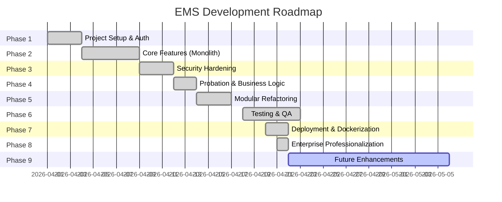

# Development Stage Roadmap
## EMS — Employee Management System
**Last Updated:** 17 April 2026

---

## Timeline Overview

---

## Phase 1: Project Setup & Authentication ✅

| Task | Status | Detail |
|------|--------|--------|
| Initialize React + Vite project | ✅ | Vite 8, React 19 |
| Setup Express.js backend | ✅ | Express + Mongoose |
| MongoDB Atlas connection | ✅ | Cloud database |
| Google OAuth 2.0 integration | ✅ | JWT-based login |
| Basic UI (Login page) | ✅ | Premium login card |
| Helmet + CORS + Rate Limiting | ✅ | Security baseline |

---

## Phase 2: Core Features (Monolith) ✅

| Task | Status | Detail |
|------|--------|--------|
| Dashboard with tabs (Feed + My Info) | ✅ | Welcome banner, stats, on-leave |
| GPS-based attendance (Leaflet map) | ✅ | Real-time radius verification |
| Camera selfie for attendance | ✅ | MediaDevices API |
| Clock In / Clock Out system | ✅ | Time + location + photo validation |
| Employee list & detail view | ✅ | Search, profile tabs |
| Leave & request management | ✅ | 8 request types, approval flow |
| Payroll module (My Payslip + Manage) | ✅ | Printable payslip, edit salary |
| Schedule calendar with holidays | ✅ | iCal integration |
| Profile management | ✅ | Self-edit with validation |

---

## Phase 3: Security Hardening ✅

| Task | Status | Detail |
|------|--------|--------|
| Auth middleware (JWT verification) | ✅ | Every protected route |
| Role-based access control | ✅ | `requireRole()` middleware |
| Input validation on all endpoints | ✅ | 4 validator functions |
| NoSQL injection protection | ✅ | `escapeRegex()` + `emailQuery()` |
| IDOR prevention | ✅ | Email-based ownership checks |
| CORS origin whitelist | ✅ | Only allowed domains |
| Rate limiting (general + auth) | ✅ | 200/15min, 20/15min |
| Security audit | ✅ | Full audit report generated |

---

## Phase 4: Probation & Business Logic ✅

| Task | Status | Detail |
|------|--------|--------|
| Auto-probation for new users | ✅ | Employment status = "Probation" |
| Contract end = join date + 3 months | ✅ | Auto-calculated on registration |
| Leave quota default = 0 | ✅ | Must be set by HRD/Admin |
| Open vs restricted registration | ✅ | `ALLOW_OPEN_REGISTRATION` env var |
| Contract end visual warnings | ✅ | Red badge when expired |

---

## Phase 5: Modular Refactoring ✅

| Task | Status | Detail |
|------|--------|--------|
| Extract `utils/helpers.js` | ✅ | Constants, formatters, Haversine |
| Create 11 view components | ✅ | Dashboard, Employee, Payroll, etc. |
| Create 5 modal components | ✅ | EditProfile, Request, Employee, Office, Payroll |
| Rewrite `App.jsx` as coordinator | ✅ | ~300 lines (from 2361) |
| Production build verification | ✅ | 0 errors, 553ms |
| Add profile photos to monthly report | ✅ | Avatar + initials fallback |

---

## Phase 6: Testing & QA 🔄 (Planned)

| Task | Status | Detail |
|------|--------|--------|
| Smoke test all views | ✅ | Manual verification per menu |
| Test role-based access (all 4 roles) | ✅ | Login as each role |
| Test attendance edge cases | ✅ | Early clock, weekend, out of range |
| Test request approval flow | ✅ | Submit → Approve/Reject/Return |
| Test payroll CRUD | ✅ | Edit salary, change status |
| Mobile responsiveness check | ✅ | Chrome DevTools responsive mode |
| Cross-browser testing | ✅ | Chrome, Firefox, Edge |

---

## Phase 7: Deployment & Dockerization ✅

| Task | Status | Detail |
|------|--------|--------|
| Containerize Frontend & Backend | ✅ | Multi-stage Docker optimization |
| Integrate MongoDB Container | ✅ | Replacing cloud Atlas with local container |
| Setup Docker Compose | ✅ | Full stack orchestration |
| Configure production env variables | ✅ | Port mapping & network sync |

---

## Phase 8: Enterprise Professionalization ✅

| Task | Status | Detail |
|------|--------|--------|
| Bulk Payroll Processing | ✅ | Finalize All & Mark All Paid |
| Payroll Audit Logs | ✅ | Track admin payroll actions |
| Attendance Reminders | ✅ | Cron-based daily check (08:30) |
| Database Backup System | ✅ | PowerShell backup script |
| Geofencing UX Polish | ✅ | Real-time status & button locking |

---

## Phase 8: Future Enhancements 📋 (Backlog)

| Feature | Priority | Description |
|---------|----------|-------------|
| Context API / Zustand | Medium | Centralize state management |
| Push notifications | Medium | Leave approval alerts |
| Multi-language (i18n) | Low | Indonesia + English |
| Dark mode toggle | Low | Theme switching |
| Advanced reporting | Medium | Charts, PDF export |
| Employee onboarding flow | Medium | Guided setup for new hires |
| Mobile PWA | Medium | Installable web app |
| Face Recognition | High | Enhanced attendance security |
